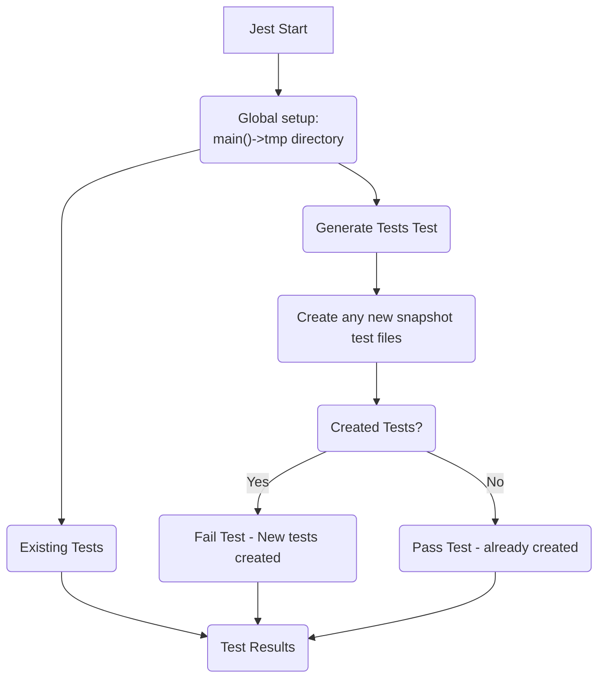

# CDK with automatic snapshots example

This is a basic CDK repo with just enough tweaks to demonstrate the changes
that you would need to do to allow for you cdk to automatically require snapshot
testing of every stack.

** Note ** this template is meant to be customized further for your use case with 
some suggested customizations being:

* Multiple context deploys and snapshotting each one
* Snapshotting just the deploy and using a monorepo pattern for shared publishable patterns.

# Structure

# bin/deploy.ts

For us to more reliably call modules from a test context, you will want to shift most of the
logic in your `bin/<package>.ts` file to a sibling file that is strictly an export.  I call it deploy.

```typescript
export function main(outdir: string) {
    app = new cdk.App(outdir)
    // actual app building logic
}
```

# bin/<package>.ts

From the preceding discusion, we end up creating a very lightweight normal deploy file. Effectively:

```typescript
main()
```

# How this works with tests

Now that we have our deploy as something that we can call completely via a script (and get the same 
context as real deploy), we can create our set of tests.

Here is how we setup our jest tests:



This flow guarantees a few things about snapshots:

1. We run all previous testss that were present in the filesystem - meaning all current snapshot tests
2. We run a script that runs the main() execution and will create any missing snapshot tests for stacks
    * This guarantees that the snapshot tests were generated on the next run
    * This also guarantees that we fail any time there are stacks without a snapshot, we fail and force
      new commits, etc.

## Why A snapshot per file?

If you've every worked with super snapshot heavy repos like what this one is proposing, PRs will become 
very difficult to understand when a snapshot is altered if all of those snapshots are in one folder.

The only way to review that would be to check the lines of the single snapshot file and figure out what
stack that was supposed to be.  Instead, if we keep one snapshot test per file, PR reviewers can verify
the context by the snapshot file name and then be confident that the changes pertain to that stack.

## How do the snapshots work?

The snapshots are prebaked in a handlebars template in test-utils.  When we create a new one, we basically
make a test file that pulls from the rendered-once application that we did in the global setup of jest.

To avoid our tests becoming very expensive, the snapshots in `tests/stack-snapshots/` are predicated on 
the idea that they are explicitly testing the way the cdk app is deployed.  Because of this, we don't want
dynamic rendering where someone could mock out critical info.  If you want to do that, I advise making separate
snapshots in a different folder so their function is clear.

## What type of magic is generate-snapshot-tests doing?

Well this part isn't exactly necessary since it just works, but it is very fun to talk about.  Since Jest
already does hoisting and mocking through their normal mock methods, we simply make a test that mocks
the `Stack` construct in `aws-cdk-lib`.  The mock simply wraps the class and checks to see if the appropriately
named snapshot test exists already.  If it does not, we denote that during the test and create the file from a
template.

The test that follows is responsible for invoking the deploy `main()` function with our now mocked `Stack` constructs
and then verifying that there were no files created.  Note, on subsequent runs, this test would pass locally, but fail
in any CI that does not have the new tests committed.


## Useful commands

* `npm run build`   compile typescript to js
* `npm run watch`   watch for changes and compile
* `npm run test`    perform the jest unit tests
* `cdk deploy`      deploy this stack to your default AWS account/region
* `cdk diff`        compare deployed stack with current state
* `cdk synth`       emits the synthesized CloudFormation template
